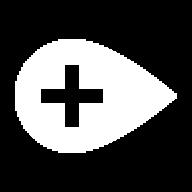

# Manipulating Images

Scale and convert images using PIL.

Images source: [images.zip](images.zip)

## Get Started
1. You can use other images. PS: Put image(s) in folder images
2. Run the script

## Result
<figure align="center">
    
    <figcaption>Original Add Location White (192 x 192 px)</figcaption>
</figure>

<figure align="center">
    
    <figcaption>Scaled and Rotated Add Location White (128 x 128 px)</figcaption>
</figure>
